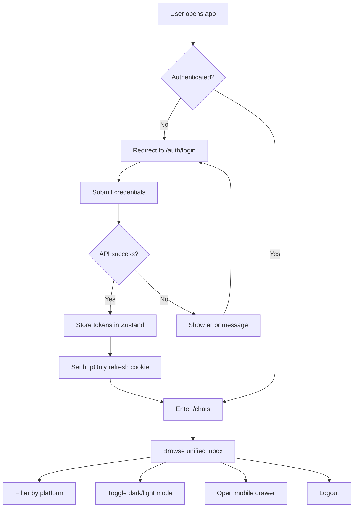
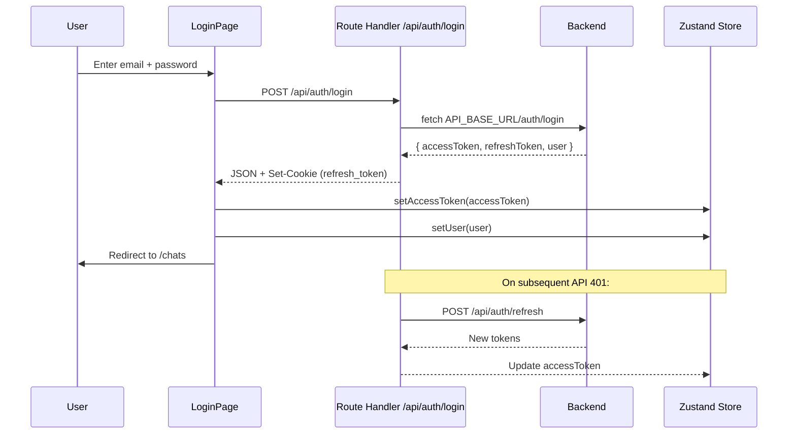
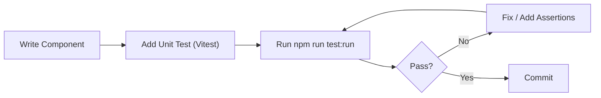
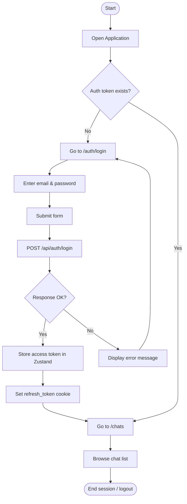
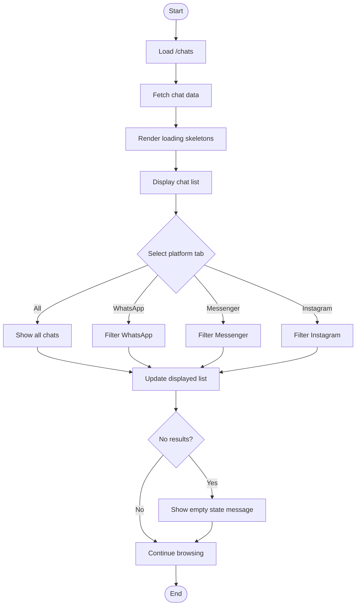
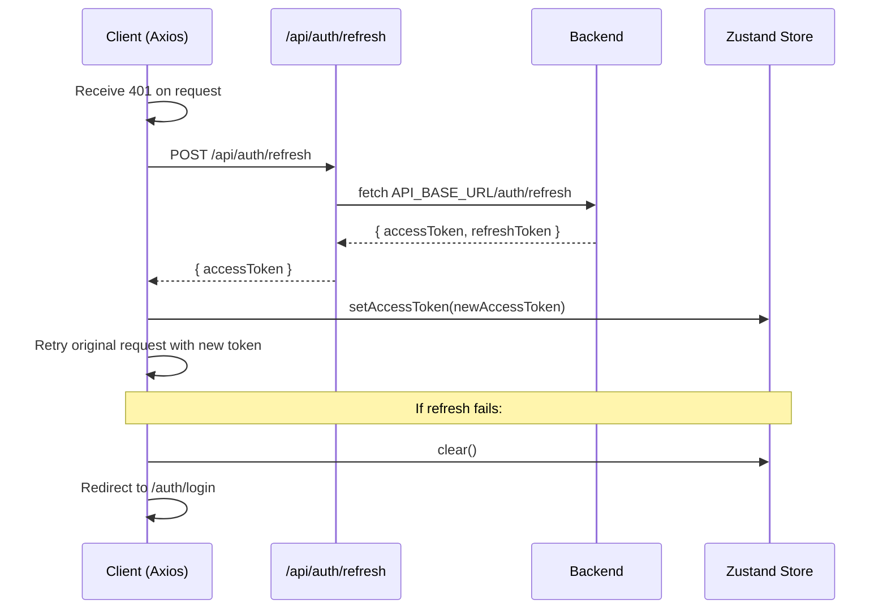

# Frontend Software Engineering Project Proposal

## 1. Project Foundation

### 1.1 Overview
This proposal documents the current implementation state of the **AllWe** frontend, a Next.js 16 application designed as a unified messaging inbox aggregating conversations across multiple chat platforms (Messenger, Instagram, WhatsApp).

### 1.2 Problem Statement
The current state consists of scaffolded Next.js application patterns, authentication routing stubs, and an inbox UI shell backed by mock chat data. Many services, pages, and backend-proxied routes are either empty placeholders or not yet wired to working implementations.

### 1.3 Objectives
- Provide responsive, theme-aware authentication screens (login/register).
- Deliver a protected unified inbox experience with platform filtering.
- Maintain a clean, scalable architecture ready for real API integration and real-time chat.
- Ensure testable UI patterns via component libraries and established testing tooling.

### 1.4 Scope
| In Scope | Out of Scope |
|----------|--------------|
| Next.js App Router scaffolding | Real-time WebSocket chat backend |
| Login/Register UI and Axios-based auth plumbing | Full server-side security enforcement |
| Unified inbox shell with mock data | Account/Security/Connected Apps pages |
| Theme toggle (light/dark) | Analytics, metrics, or admin dashboards |
| Unit testing foundation | End-to-end test coverage |

---

## 2. Technical Architecture

### 2.1 Frontend Technology Stack

| Layer | Technology | Version / Notes |
|-------|------------|-----------------|
| Framework | Next.js | 16.2.9 (App Router) |
| Runtime | React | 19.2.4 |
| Language | TypeScript | 5 |
| Styling | Tailwind CSS | 4 with CSS variables |
| UI Components | shadcn/ui (radix-nova) | Radix UI primitives + Tailwind |
| Icons | lucide-react, react-icons, @fortawesome | Platform-specific icons supported |
| State Management | Zustand | Client-side auth state only |
| HTTP Client | Axios | Interceptors for auth + refresh logic |
| Theme | next-themes | Light/dark mode |
| Testing | Vitest + Testing Library | jsdom environment |

### 2.2 Project Architecture
The application follows the Next.js App Router architecture with:
- **API Route Handlers** under `src/app/api/` to proxy requests to the backend (`API_BASE_URL`).
- **Route Groups** like `(protected)` to wrap authenticated pages with layout logic.
- **Client Components** for interactive UI (`"use client"`).
- **Server Components** for static or server-rendered content.
- **Service Layer** skeletons for API communication (mostly unpopulated).

### 2.3 Folder Structure

```
src/
├── app/
│   ├── api/
│   │   └── auth/
│   │       ├── login/route.ts          # Proxies /auth/login to backend
│   │       └── refresh/route.ts        # Proxies /auth/refresh to backend
│   ├── (protected)/                    # Auth-wrapped route group
│   │   ├── layout.tsx                  # Wraps children in AuthBootstrap
│   │   └── chats/
│   │       └── page.tsx                # Unified inbox page
│   ├── auth/
│   │   ├── login/page.tsx              # Login form
│   │   └── register/page.tsx           # Registration form
│   ├── dashboard/
│   │   ├── layout.tsx                  # Empty placeholder
│   │   ├── page.tsx                    # Empty placeholder
│   │   ├── chats/page.tsx              # Empty placeholder
│   │   ├── settings/page.tsx           # Empty placeholder
│   │   ├── navbar/page.tsx             # Navbar component (misplaced in route folder)
│   │   └── sidebar/page.tsx            # Sidebar component (misplaced in route folder)
│   ├── layout.tsx                      # Root layout (ThemeProvider, fonts)
│   ├── page.tsx                        # Next.js default landing page
│   ├── loading.tsx                     # Default loading spinner
│   ├── error.tsx                       # Generic error boundary
│   └── not-found.tsx                   # 404 page
├── components/
│   ├── ui/                             # shadcn/ui primitives (24 components)
│   ├── auth-bootstrap.tsx              # Empty wrapper for protected routes
│   ├── chat/                           # Stubs only (no implementation)
│   │   ├── ChatInput.tsx
│   │   ├── ChatWindow.tsx
│   │   └── Message.tsx
│   └── inbox/                          # Implemented workspace components
│       ├── app-sidebar.tsx             # Sidebar with logout dialog
│       ├── chat-header.tsx             # Header with theme toggle + notifications
│       ├── chat-list.tsx               # Virtualized-ready list with loading skeleton
│       ├── chat-list-item.tsx          # Individual chat row
│       ├── chat-tabs.tsx               # Platform tab filters
│       └── mobile-drawer.tsx           # Mobile navigation sheet
├── config/
│   ├── api.ts                          # Axios instance configuration
│   └── navigation.ts                   # Re-exports navigation constants
├── constants/
│   ├── api-endpoints.ts                # API endpoint constants
│   └── navigation.ts                   # Sidebar and navbar navigation maps
├── hooks/
│   ├── use-mobile.ts                   # Mobile breakpoint detection
│   ├── useAuth.ts                      # Empty stub
│   └── useSocket.ts                    # Empty stub
├── lib/
│   ├── axios.ts                        # Axios instance + auth interceptors
│   ├── interceptors.ts                 # Generic interceptor template (unused)
│   ├── jwt.ts                          # JWT expiry extraction helper
│   ├── schedule-refresh.ts             # Token refresh scheduling
│   ├── socket.ts                       # Empty stub
│   └── utils.ts                        # cn() class name merger
├── services/
│   ├── auth.service.ts                 # Empty
│   ├── chat.service.ts                 # Empty
│   ├── post.service.ts                 # Empty
│   └── user.service.ts                 # Commented boilerplate only
├── store/
│   └── auth-store.ts                   # Zustand auth state + refresh scheduler
├── types/
│   └── chat.ts                         # Chat interface + mock data
└── __tests__/
    ├── setup.ts
    └── Button.test.tsx                 # Unit test example
```

### 2.4 State Management Strategy

- **Zustand** is used exclusively in `src/store/auth-store.ts` to hold:
  - `accessToken`
  - `user` object
  - `setAccessToken` (also schedules refresh)
  - `setUser`
  - `clear`
- No other global stores exist.
- Local UI state (form inputs, tab selection, mobile drawer) is managed with React `useState`.

### 2.5 API Integration Patterns

| Pattern | Implementation |
|---------|----------------|
| Proxy API Routes | Next.js handlers in `src/app/api/auth/` forward requests to `process.env.API_BASE_URL`. |
| Axios Instance | Exported from `src/lib/axios.ts` with `NEXT_PUBLIC_API_URL` and `withCredentials`. |
| Request Interceptor | Attaches `Authorization: Bearer <accessToken>` using `useAuthStore.getState()`. |
| Response Interceptor | On 401, attempts token refresh via `/api/auth/refresh`. Queues concurrent requests during refresh. Logs out and redirects on failure. |
| Cookie Handling | Refresh token stored as `httpOnly`, `secure`, `sameSite: "lax"`, 30-day maxAge. |

### 2.6 Input Validation Methods

- **Validated**: HTML5 `type="email"` and `required` attributes on login/register inputs.
- **Not Implemented**: No schema-based validation (e.g., Zod, Yup), server-side validation feedback beyond generic error messages, or custom validation rules.

---

## 3. Functional Specifications

### 3.1 Main Modules / Pages

| Module | Route | Implementation Status |
|--------|-------|-----------------------|
| Landing / Home | `/` | Implemented (Next.js placeholder) |
| Login | `/auth/login` | Implemented |
| Register | `/auth/register` | Implemented (frontend only; backend route missing) |
| Unified Inbox | `/chats` | Implemented (UI shell + mock data) |
| Dashboard | `/dashboard` | Empty shell |
| Settings | `/dashboard/settings` | Empty shell |
| Account / Security / Connected Apps | Referenced in navigation | Not Implemented |
| Chat Detail / ChatWindow | N/A | Stubbed (empty components) |
| Logout | Sidebar action | UI only (toast; no API call) |

### 3.2 User Flow



### 3.3 Functional Requirements

| Requirement | Status |
|-------------|--------|
| User registration form | Implemented (frontend only) |
| User login form with email/password | Implemented |
| JWT access token storage in client state | Implemented |
| HttpOnly secure refresh token cookie | Implemented |
| Automatic token refresh before expiry | Implemented |
| Concurrent request queuing during refresh | Implemented |
| Multi-platform chat list with mock data | Implemented |
| Platform tab filtering (All/Messenger/Instagram/WhatsApp) | Implemented |
| Responsive sidebar + mobile drawer | Implemented |
| Dark/light theme toggle | Implemented |
| Loading skeletons | Implemented |
| Error boundary and 404 pages | Implemented |
| Real-time chat messaging | Not Implemented |
| Search / conversation detail view | Not Implemented |
| Server-side protected route enforcement | Not Implemented |
| Forgot password functionality | Not Implemented (static link only) |
| Google OAuth button | Implemented (UI only) |

### 3.4 Non-Functional Requirements

| Requirement | Status |
|-------------|--------|
| TypeScript strict mode | Implemented |
| Responsive design (mobile + desktop) | Implemented |
| Theme support (light/dark) | Implemented |
| Test environment (Vitest) | Implemented |
| Linting (ESLint) | Implemented |
| Token refresh security (queuing + redirect) | Implemented |
| Performance-optimized fonts (Geist) | Implemented |
| Accessibility via Radix UI primitives | Partially Implemented |
| End-to-end test coverage | Not Implemented |
| API rate limiting / retry policy | Not Implemented |
| i18n / localization | Not Implemented |

### 3.5 Authentication / Authorization Flow



**Notes:**
- The middleware at `/chats/:path*` matches protected routes but currently calls `NextResponse.next()` without session validation.
- `AuthBootstrap` is an empty wrapper and does not verify authentication client-side before rendering protected content.

---

## 4. Design and Methodology

### 4.1 UI/UX Design Summary
- **Design System**: Neutral base palette (`oklch` color space) with CSS variables, supporting light and dark modes.
- **Layout**: Desktop uses an offcanvas collapsible sidebar with header, tabbed content area, and scrollable list. Mobile transitions sidebar to a `Sheet` (drawer).
- **Typography**: Geist Sans (UI) and Geist Mono (code/monospace) via `next/font/google`.
- **Feedback**: Toast notifications via `sonner`; loading skeletons in chat list; disabled states during login/register submission.
- **Branding**: Minimal "CN" logo mark and "CodexNepal" wordmark in sidebar/header.

### 4.2 Frontend Development Approach
- **File-based routing** with Next.js App Router.
- **Component composition** using `asChild` pattern from Radix UI for flexible element rendering (e.g., `Button`, `SidebarMenuButton`).
- **Utility-first CSS** via Tailwind 4 with `tw-animate-css` and `tailwind-merge` for dynamic class merging (`cn()`).
- **Service layer pattern** present in structure but largely unimplemented; API calls currently made directly with `fetch` in pages and Axios interceptors in `lib/axios.ts`.
- **Environment configuration**: Backend URL expected in `API_BASE_URL` (server) and `NEXT_PUBLIC_API_URL` (client).

### 4.3 Testing Approach

| Type | Tools | Current Coverage |
|------|-------|------------------|
| Unit Tests | Vitest + Testing Library + jsdom | Button component only |
| Integration / API Route Tests | Vitest | Not Implemented |
| E2E Tests | Not configured | Not Implemented |



---

## 5. Future Roadmap

| Priority | Enhancement | Notes |
|----------|-------------|-------|
| High | Complete `/api/auth/register` route handler | Frontend page exists but backend proxy missing |
| High | Populate `chat.service.ts`, `user.service.ts` | Enable real data fetching |
| High | Implement `ChatWindow`, `ChatInput`, `Message` | Wire to backend chat endpoints |
| High | Real WebSocket layer (`src/lib/socket.ts`) | Replace mock data with live updates |
| Medium | Add React Hook Form + Zod validation | Replace HTML5-only validation |
| Medium | Protect routes server-side | Implement DAL/session checks in middleware and server components |
| Medium | Populate dashboard settings and account pages | Fulfill nav links |
| Medium | Expand test suite | Cover login, chat list, interceptors |
| Low | Forgot password + reset flow | Backend-dependent |
| Low | Google OAuth integration | Replace placeholder button |
| Low | Analytics / message search | Post-MVP features |

---

## Appendix: Key Diagrams

### Use Case Diagram

```mermaid
useCaseDiagram
    actor User
    actor Backend

    User --> (Login)
    User --> (Register)
    User --> (View Unified Inbox)
    User --> (Filter by Platform)
    User --> (Toggle Theme)
    User --> (Logout)
    (Login) ..> Backend : Calls via proxy
    (Register) ..> Backend : Calls via proxy
    (View Unified Inbox) ..> Backend : Fetches chats
```

### Activity Diagram: Authentication and Access



### Activity Diagram: Chat Inbox Interaction



### Sequence Diagram: Token Refresh Flow



### System Flowchart

```mermaid
flowchart TD
    Root[App Root] --> Layout[layout.tsx]
    Layout --> Theme[ThemeProvider]
    Theme --> Page{Route}

    Page -->|/| Home[page.tsx Placeholder]
    Page -->|/auth/login| Login[LoginPage]
    Page -->|/auth/register| Register[RegisterPage]
    Page -->|/chats| Protected[(protected) layout]
    Page -->|/dashboard| Dashboard[dashboard layout]
    Page -->|*| NotFound[not-found.tsx]

    Protected --> Bootstrap[AuthBootstrap]
    Bootstrap --> Chats[ChatsPage]

    Chats --> Sidebar[AppSidebar]
    Chats --> Header[ChatHeader]
    Chats --> Tabs[ChatTabs]
    Chats --> List[ChatList]
    Chats --> Mobile[MobileDrawer]

    List --> Item[ChatListItem]
    Item --> Empty[Empty state / Loading skeleton]

    Sidebar --> Logout[Logout AlertDialog]
    Logout --> Toast[Toast success -- no API call]
```

---

*Document generated based solely on source code implementation found in `D:\volumeE\codexchat\frontend\aone-frontend`.*
